# Historical Index, Sector and Stock Market Analysis

## Questions:
 
### Analysis Framework:

#### **Market Statistics Report:**
1. Review stock, index and stock performance over 1, 5 and 10 year windows.
2. Show relationships between indexes, sectors and stocks.
3. Rank order and identify top performing indexes, sectors and stocks within the time periods selected.
4. Identify relationships between the time periods - which indexes and stocks perform consistently?
5. Identify top 10 most efficient stocks per the sharpe ratio for further portfolio development and analysis.

#### **Fundamental Report:**
6. Identify best value and growth portfolio stocks for further portfolio development and analysis.

#### **Optimal Portfolio Simulated Returns and Analysis:**
7. Run MC simulations on best set of value, growth and sharpe ratio portfolios across 1,5 and 10 year time periods.
8. Identify which equal weighted portfolio performs best in a scenario analysis.
9. Summarize optimal portfolio findings.


# Report 1 : **Market Statistics Report**

## ***Overview of Indexes, Sectors and Stocks used in analysis:***

### **Indexes**:

- **DIA** - Dow Jones Industrial Average
- **SPY** - S&P 500
- **QQQ** - Nasdaq 100
- **IWM** - Russell 2000

### **Sectors**:

- **IYC** - Consumer Discretionary
- **IYH** - Healthcare
- **IYK** - Consumer Staples
- **IYR** - Real Estate
- **IYZ** - Communication Services
- **XLB** - Materials
- **XLE** - Energy
- **XLF** - Financials
- **XLI** - Industrials
- **XLK** - Technology

### **Optionable Stock Universe:**
#### Consumer Discretionary:
- SBUX
- TSLA
- GM
- HD
- M
- MGM
- NKE
- ETSY
- DHI
- AMZN
#### Consumer Staples:
- BYND
- ADM
- CAG
- PEP
- MO
- KO
- WMT
- TGT
- PG
- PM
#### Healthcare:
- PFE
- WBA
- MDT
- JNJ
- MRK
- MRNA
- CVS
- CAH
- AMGN
- ABBV
- ABT
- BMY
#### Real Estate:
- WELL
- AMT
#### Communications:
- ATVI
- DIS
- DISH
- NFLX
- META
- TMUS
- SNAP
- SPOT
- T
- ROKU
- VZ
#### Materials:
- WPM
- X
- GOLD
- NEM
- FCX
#### Energy:
- SLB
- VLO
- HAL
- MRO
- MPC
- OXY
- CVX
- CCJ
- DVN
- APA
#### Financials:
- BX
- BAC
- AFL
- AXP
- C
- MS
- JPM
- COF
- GDXJ
- MA
- MARA
- PYPL
#### Industrials:
- BA
- AAL
- CSX
- DAL
- CAT
- MMM
- GE
- LUV
- RTX
- PLUG
#### Technology:
- AAPL
- AMD
- CRM
- HPQ
- INTC
- MRVL
- MSFT
- MU
- NVDA
- ORCL
- QCOM
- SQ
- ZM

<br>

## ***Optionable Stock Universe:***
-------------------
#### We did not use all 5,000+ stock tickers for this analysis but limited our analysis to what we called the “Optionable Stock Universe”, this universe is defined by stocks that have the following characteristics:
- Options securities available to trade
- Weekly expiration dates on options available to trade
- Tight bid-ask spreads = liquidity on weekly options expirations
-  \> 1 MM in average daily stock trading volume 

<br>


## Count of stocks by sector bar chart:
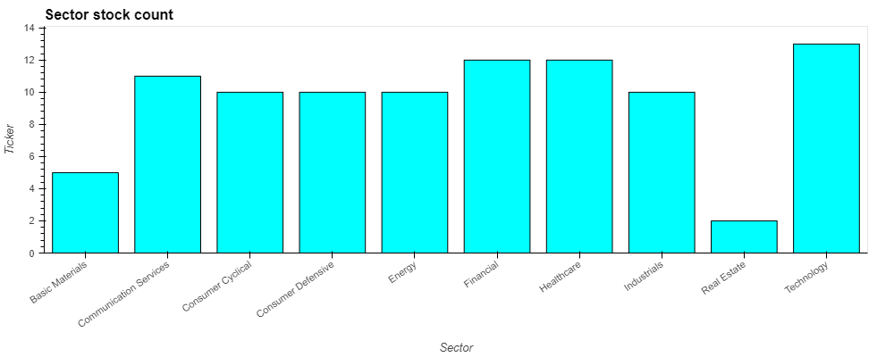
​
<br>
-----------------

## ***Performance Analysis Framework:***
### Our analysis methodology focused on 3 key metrics:  
- Mean Returns (annualized)
- Standard deviation of Returns
- Sharpe Ratios of Index, Sector or Stock (assumes 1 index, sector or stock portfolio)


## **We utilized 3 different time periods for analysis:**
-----------------------
- 1 year
- 5 years
- 10 years

##### The objective was to identify which index, sectors and stocks were more or less correlated; and which indexes, sectors and stocks produced the best sharpe ratios as a proxy for most efficient returns per unit of risk.  The top performing sharpe ratio stocks would then be utilized in creating optimal portfolios for future returns and risk forecasting.

## ***INDEXES PERFORMANCE:***


###    Initial performance analysis for index and sectors show us a couple of key trends and insights:

------

### Ranking performance by indexes:

	1-year			5-year			10-year
    QQQ	9.5%		QQQ	97%		QQQ	383%			
    DIA	6.5%		SPY	65%		SPY	204%
    SPY	5.4%		DIA	51%		DIA	176%
    IWM	1.4%		IWM	17%		IWM	106%

##### So when passive investors are told to “buy and hold” the market to capture market returns, what Index defines the market?  The Russell 2000 covers 10% of the market and produces the lowest returns.  The S&P covers 75% of the market and has returns ~35-45% lower than the NASDAQ.  The Dow Jones Industrial Average is a well known index but it covers only 30 stocks and performs worse than the S&P and NASDAQ.  General rule is the S&P 500 is the market and we’ll go with that assumption.

##### Over the analysis time periods, the NASDAQ has consistently beaten all other indexes in returns by a fairly large margin while the Russell 2000 has been the poorest performer, with the S&P being the 2nd best performing Indexes.

#### Ranking performance by indexes sharpe ratio performance (assuming portfolio of 1 in each case):

-------

	1-year			5-year			10-year
    QQQ	0.289		QQQ	0.461		QQQ	0.614		
    DIA	0.167		SPY	0.345		SPY	0.438
    SPY	0.123		DIA	0.258		DIA	0.386
    IWM	-0.012		IWM	0.006		IWM	0.213

#### From a sharpe ratio ranking perspective, all indexes rank order similar to their ranking based on returns alone.  Investing in the NASDAQ provided a superior risk-return ratio vs. investing in any of the other indexes.  S&P performs slightly better than the Dow in 5 and 10 year timeframes but has been lagging in the 1 year timeframe. 

<br>


## 3 Efficient Frontier Indexes and Sector Charts
-------
<br>

​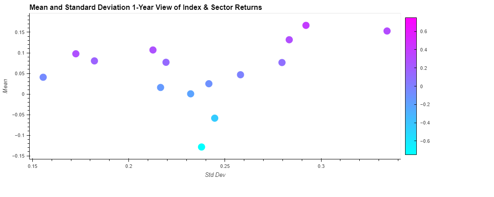

--------
<br>

​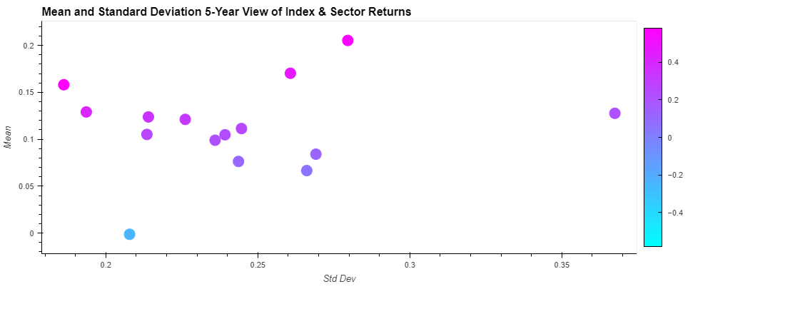

------
<br> 

​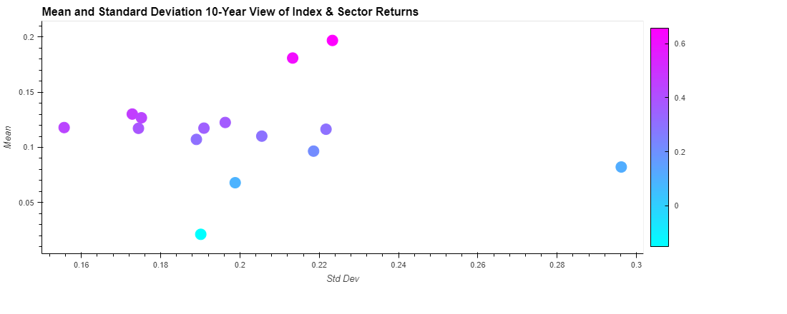


<br>

## ***SECTOR PERFORMANCE:***
-------
### ***Ranking performance by sector cumulative returns:***
<br>

### **Top 3 performing sectors for returns:**

-------------

	    1-year					5-year					        10-year
    Technology	13.1%		Technology		    128.7%		Technology		       454.5%
    Energy		10.1%		Consumer Staples	    101.4%		Healthcare		    215.3%
    Industrials	 8.7%		Healthcare		    73.2%		Consumer Staples	    187.0%


- Technology is clearly the BEST performing sector across all timeframes and is consistently the best performing sector.
- Healthcare and Consumer Staples round out the top 3 in 5 and 10 year timeframes for top cumulative returns.
- Energy and Industrials are in the top 3 performers for the last year.  A hypothesis here is this could be inflation driven performance numbers.

### ***Bottom 3 performing sectors for returns:***
-----------

	1-year					        5-year                              10-year
    Communications       -14.3%		Communications	     -10.8%		    Communications            3.2%
    Real Estate	       -8.4%		Real Estate		25.9%		    Energy		         46.1%
    Financials	       -2.6%		Financials		26.9%		    Real Estate	            61.3%

- Communications is clearly the WORST performing sector across all timeframes and is consistently the best performing sector.
- Real Estate and Financial round out the bottom 3 across all timeframes.
- There is clear consistency in the top performing and bottom performing sectors across almost all time periods analyzed.
- The cumulative return gap across time between the top performing and bottom performing sectors is significant as an investor.  Just concentrating investment bets by sector would dramatically improve cumulative return performance.

<br>

## **INDEX AND SECTOR CORRELATIONS:**
----------------
- Correlation coefficients across all indexes and sectors converge close to 1 as time increases to 10 years.  
- The assumption here is based on the correlation coefficient formula, as the sample size increases with time, the - correlation coefficient increases over time.
- This means 1-year correlations with less sample sizes have lower values. 
- Question becomes does this mean that over time, if more sectors are approaching a correlation of 1 that - diversification across sectors does not really reduce volatility and risk?
- The energy and communications sectors show the least correlation over time and does not converge to 1 like the - other sectors.  
- Hypotheses include newer companies more present in the communications sector means less sample size for 10 years
- Energy sector is just a unique animal that more closely correlates to volatile oil prices vs other stock sectors in - the US

<br>

### 1 Year Correlation Matrix:
---------

​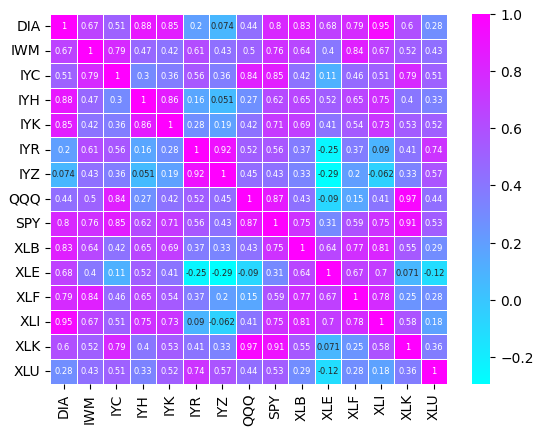

<br>

### 5 Year Correlation Matrix:
---------

​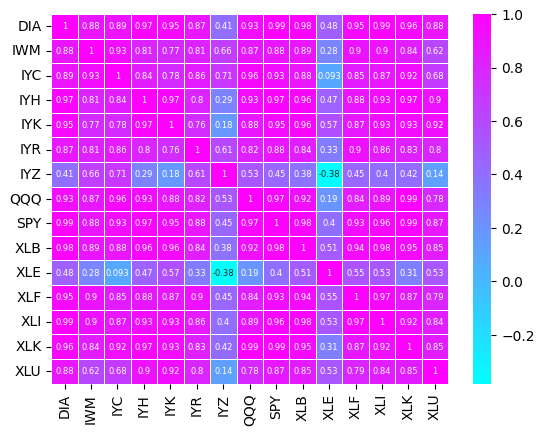

<br>

### 10 Year Correlation Matrix:
----------

​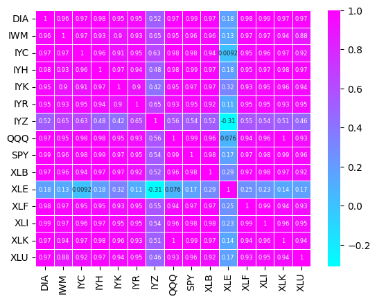

<br> 

## **EFFICIENT FRONTIER FOR OPTIONABLE STOCKS - 1, 5, 10-Year Views:**
-------------

### **Mean, Standard Deviation and Sharpe Ratio:**

- The efficient investment frontier for stocks is the line that represents the highest returning stocks with the lowest standard deviations.  Investors should invest in only these stocks and not in stocks producing lower returns with higher risk.
- This frontier can be seen by highlighting the sharpe ratio of stocks plotted alongside stock means and standard deviations.
- The charts in this section cover these metrics for the optionable stock universe for 1, 5 and 10 years.
- We can clearly see a leading edge of stocks that constitute the most efficient risk-return stocks an investor would want in their portfolio.  This also shows us the inefficient stocks investors should not include in their portfolios.


<br>

## **Mean and standard deviation of returns for optionable stock universe 1, 5, 10-Year Views:**
---------
### **1 Year View:**


​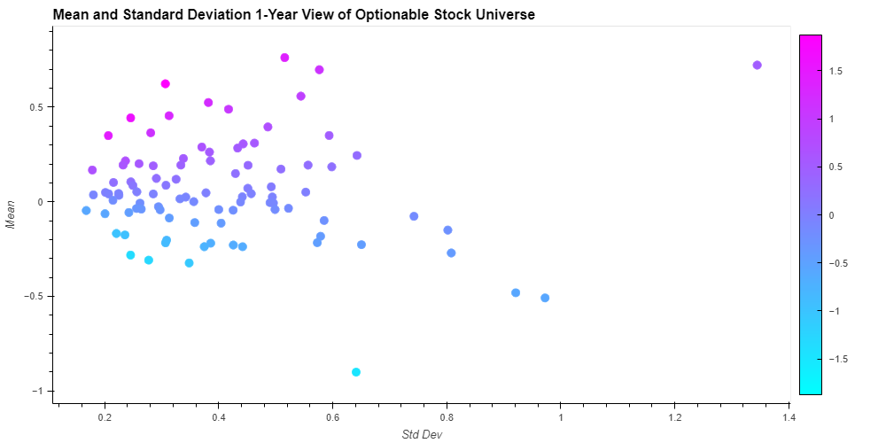

<br>

### **5 Year View:**
---------

​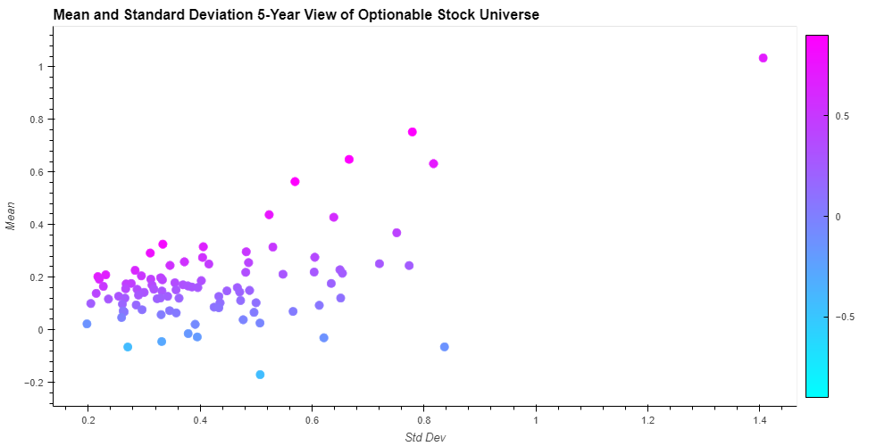

<br>

### **10 Year View:**
----------

​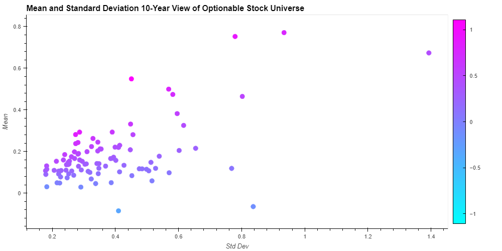

<br> 


## **Top 10 Sharpe Ratio Stocks by Time Frames:**
--------------- 

<br>

### **Sharpe Ratio's Findings for Portfolios 1, 5, 10-Year Views:**
---------
### **1 Year View:**


​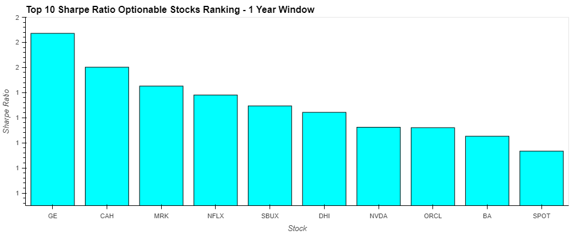

<br>

### **5 Year View:**
---------

​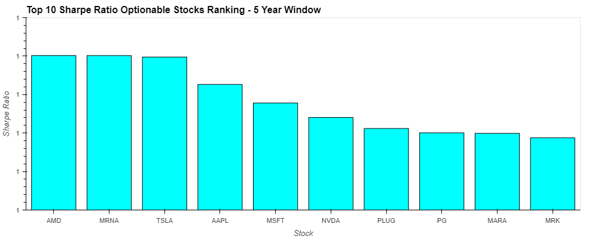

<br>

### **10 Year View:**
----------

​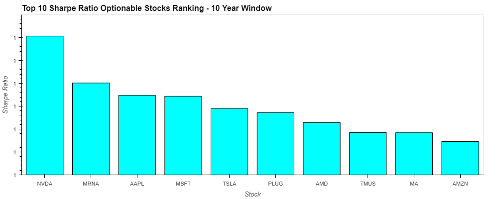

<br> 


## **VALUE vs GROWTH PORTFOLIOS:**

### **Portfolio Definition and Analysis:**

- After developing 3 portfolios based on sharpe ratios over various time periods, 2 additional portfolios will be developed for final portfolio optimization forecasting.  A value and growth portfolio.
- A simple criteria was used to split the optionable stock universe into value stocks and growth stocks: 
    - Value: 		PE Ratio < 15 and Dividend Yield > 2%
    - Growth:		PE Ratio > 15 and Dividend Yield < 2%
- The goal was to identify 3 value and 3 growth stock portfolios for further optimization analysis.  1 for each time period under consideration: 1, 5 and 10 year risk-return windows.
- Value stocks make up a larger proportion of select industries:
    - Financials
    - Energy
- Growth stocks also make up a larger proportion of select industries:
    - Technology
    - Communications

## **Dividend/Yield Matrix Chart:**
-------

​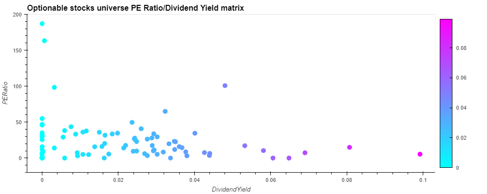

 <br>

## **Growth v Value Distribution Chart:**
------

​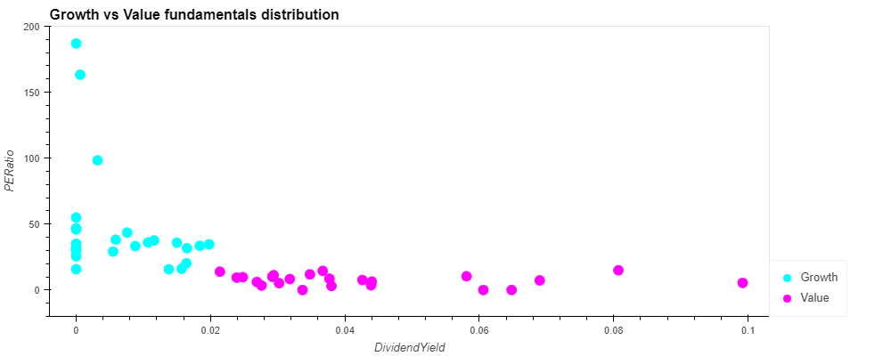

<br>

## **Bar Chart showing split by sector:**
------

​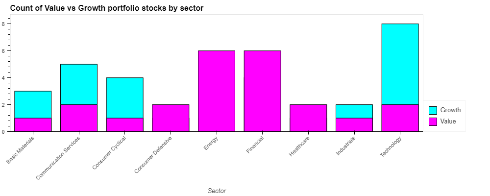

<br>

## **Top Value and Growth Stocks: Ranked by Sharpe Ratio:**

- After segmentation, stocks were analyzed based on sharpe ratios and rank ordered for selection.
- We selected the top 5 value and top 5 growth stocks for each time period: 1, 5 and 10 years for further portfolio optimization analysis
- All value stock returns were adjusted for dividend yield to ensure an apples to apples comparison
- Key findings:
    - The top 5 growth stocks clearly show higher sharpe ratios vs. the top 5 value stocks
    - The final portfolio of selected stocks for the growth portfolio show some overlap with the top ranked sharpe ratio stocks
    - There is no overlap with the top 5 value stocks ratio rankings and the top 10 sharpe ratio ranking lists above


## **MULTIPLE PORTFOLIO ANALYSIS FOR FUTURE RETURNS:**

- We have now created 9 portfolios selected from the top ranked sharpe ratios from the analysis above
- We will run MC simulations with equal weighted stock positions in each portfolio to identify the best performing portfolios from a cumulative 5-year return perspective and sharpe ratio perspective.


## **Box Plot showing min, 25%, 50%, 75% and max for each portfolio:**
---------

​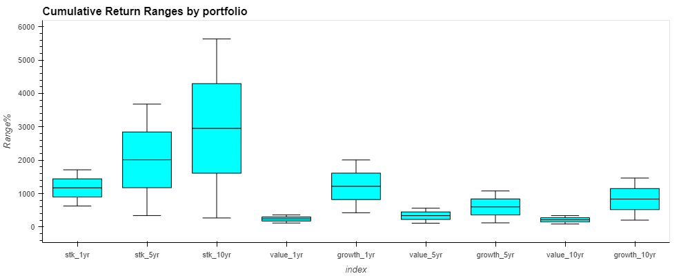
<br>

## **2x2 matrix showing cumulative 5-year returns vs. sharpe ratios for all 9 portfolios**
--------

​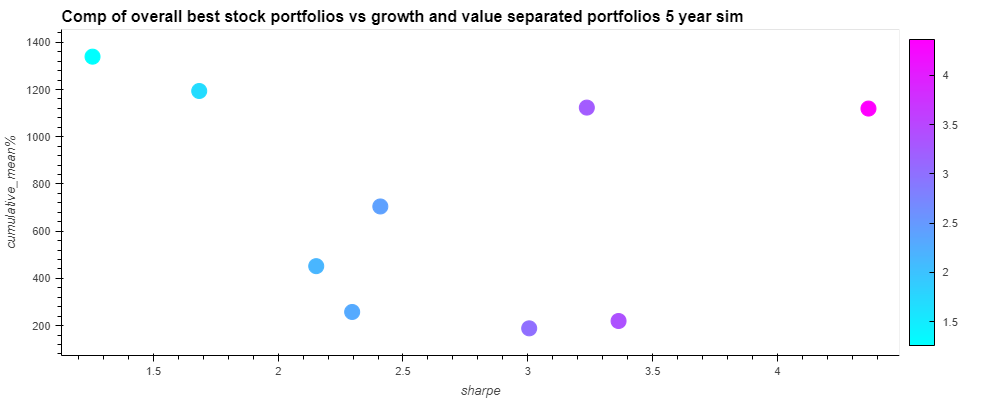

<br>


## **Analysis Conclusion:**
-----------
1. KEY CONCLUSIONS FROM PORTFOLIO SIMULATIONS:
    - *If investors want to maximize cumulative 5-year returns on their investments, the portfolio rank ordering is as follows:*
        - Growth - 1 year data
        - Top 10 Sharpe Ratio - 10 year data
        - Top 10 Sharpe Ratio - 5 year data
        - Top 10 Sharpe Ratio - 1 year data
        - Growth - 10 year data
        - Growth - 5 year data
        - Value - 5 year data
        - Value - 1 year data
        - Value - 10 year data
    - *If investors want to maximize portfolio sharpe ratios, the portfolio rank ordering is as follows:*
        - Top 10 Sharpe Ratio - 1 year data
        - Value - 1 year data
        - Growth - 1 year data
        - Value - 10 year data
        - Value - 5 year data
        - Growth - 10 year data
        - Top 10 Sharpe Ratio - 5 year data
        - Growth - 5 year data
        - Top 10 Sharpe Ratio - 10 year data
- Question for investors becomes what is their investment objective:  to maximize cumulative returns over 5 years or to maximize returns per unit of risk over the next 5 years?
- The projected opportunity cost of risk efficiency is forgoing ~xxx% in cumulative returns vs the maximum return portfolio
- All these portfolio generate fantastic returns vis-a-vis indexes and project sharpe ratios much higher than historical indexes
- A select handful of stocks stick out as potential future investments with probability of great returns, the unknown is will value or growth stocks perform better moving forward?
- Growth Stocks & Top Sharpe Ratio Ranked Stocks (4):
    - NVDA
    - AAPL
    - MSFT
    - ORCL
- Value Stocks Only (4):
    - MS
    - JPM
    - MPC
    - AFL
- Top Sharpe Ratio Ranked Stocks Only (4):
    - GE
    - CAH
    - MRK
    - DHI
    
-----------------------
- In conclusion, a key assumption of future stock performance's are economic conditions that move forward and will have similar impacts on growth and value stocks as they have the last 10 years.  The big change though is the last 10 years were 0% interest rate, low inflation economic conditions where investors search for yield and growth.  In a high interest rate, higher inflation rate environment moving forward, does value outperform growth?  When investors can get a risk free 5% yield on their money, investing in riskier assets is not as appealing.
--------------

## Notebooks
- [JUPYTER LAB NOTEBOOK LINK](./main.ipynb)
- [Final Analysis](./file.ipynb)

<br>


## Getting Started

### Prerequisites
​
### ​You must have Python 3 installed:

```
python3 --version
```

### You must have Anaconda installed:
```
$ anaconda --version
```


### Install Environmnet:
```
conda create -n <env_name> python=3.7 anaconda
```

### Clone/Run Repository 
```
git clone git@github.com:vkhorozian/Project-1.git
```

### Activate Environment
```
conda activate <env_name>
```

### Install Dependencies
- Please make sure you are in your intended activate environment before running this command
```
pip install -r requirements.txt
```


## Built With

- []([https://www.python.org/downloads/release/python-3713/)
[](https://www.python.org/downloads/release/python-3713/) - Programming Language
- [](https://pandas.pydata.org/docs/#) - Data maniupulation library
- [](https://numpy.org/) - Multi-dimensional array library
- [](https://plotly.com/python/) - Visualization library for plots
- [](https://matplotlib.org/) - Visualization library for plots
- [](https://seaborn.pydata.org/) - Visualization library for plots
- [](https://alpaca.markets/) - Trading API
- [](https://hvplot.holoviz.org/) - Visualization library for plots
- [](https://pyviz.org/) - Visualization library for plots
- [](https://geoviews.org/) - Visualization library for plots
- [](https://jupyter.org/) - Notebook IDE
- [](https://jupyter.org/) - Notebook IDE
- [](https://www.anaconda.com/) - Data science platform
- [](https://pypi.org/project/yfinance/) - Yahoo Finance API

## Authors
- **Varoujan John Khorozian** - [LinkedIn](https://www.linkedin.com/in/varoujan-khorozian/) | [Github](https://github.com/vkhorozian)
- **Kirill Chugunov** - [LinkedIn](https://www.linkedin.com/in/kirill-chugunov-b680811a4/) | [Github](https://github.com/OddMerchantStudios)
- **Hiren Patel** - [LinkedIn](https://www.linkedin.com/in/hdpatel/) | [Github](https://github.com/hpnhs25)
